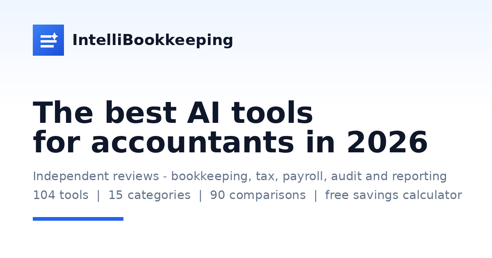

<h1 align="center">IntelliBookkeeping</h1>

<i>The best AI tools for accountants and bookkeepers.</i>

  
  

## About

IntelliBookkeeping is an independent directory and review site for the AI software that accounting firms actually use — across bookkeeping, tax, invoicing, payroll and audit. I designed and built it on a custom PHP directory engine, with side-by-side comparisons, honest pricing (including free plans), and an interactive savings calculator for firms.

## Key features

- **Independent reviews** — 100+ AI tools reviewed across 15 categories
- **Side-by-side comparisons** — 90+ head-to-head pages so buyers can decide quickly
- **Honest pricing** — free plans and published prices surfaced; where a price isn't public, it says so rather than guessing
- **AI Savings Calculator** — an interactive tool that estimates the hours and money AI could save a practice, based on team size, rate and workload
- **Directory engine** — a config-driven platform I built to stand up niche directory sites fast
- **SEO-first** — clean URLs, structured data, sitemaps and fast, cache-friendly pages

## Built with

    

## Directory and comparison methodology

The documented architecture uses a configurable PHP directory engine to present software records, categories, comparisons and a savings calculator. Vendor pricing changes; a useful record should distinguish published pricing, an unavailable price and an estimate, with source and last-checked date.

Comparison pages should identify the criteria and evidence behind each conclusion. Calculator outputs are estimates dependent on workload, adoption and hourly-rate inputs, not a promise of savings. The public repository does not include the calculator formula or a verification dataset, so those assumptions remain to be documented from the private implementation.

This is a documentation-only case study. Tool counts describe the project and can change; no audited financial benefit, traffic or conversion uplift is asserted here.

## About this repository

This is a **case study** of a production project I designed, built and maintain. The application is live at **[intellibookkeeping.com](https://intellibookkeeping.com/)**. The source code is proprietary and kept private — this page documents the work and the engineering behind it.

---

Built by <b><a href="https://jeemmo.com/">Azeem Javed (Jeemmo)</a></b> · <a href="https://www.linkedin.com/in/azeem-javed-7666861a/">LinkedIn</a> · Jeemmo is the trading name of Verivello Ltd, a UK-registered company.
